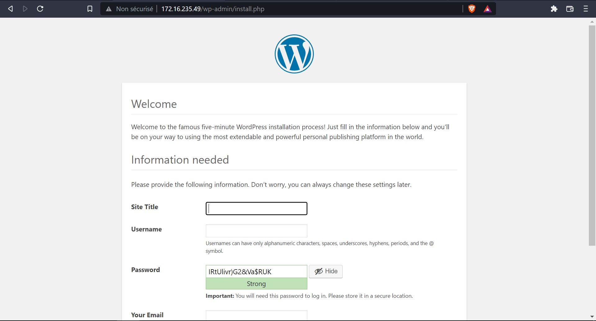

### Etape 1
pour crée un `utilisateur` :
```bash
useradd
```

pour avoir la liste des `utilisateurs` :
```bash
cat /etc/passwd
```


pour crée un `groupe` et définir son GID :
```bash
groupadd -g {GID}
```


pour ajouter l'`utilisateur` au `groupe` :
```bash
gpasswd -a {utilisateur} {groupe}
```

### Etape 2


pour ajouter un utilisateur au `permisions sudo` :
```bash
sudo visudo
```
Puis on modifie le fichier avec cette ligne : 
```bash
#Members of the group 'admin' may gain root privileges
%admin ALL=(ALL) NOPASSWD:ALL
````

### Etape 3
pour générer la `clé ssh` :
```bash
ssh-keygen -t rsa -b 2048 -C {login}@{domain}
```

crée un home pour l'utilisateur bob ainsi qu'un dossier .ssh avec à l'intérieur un fichier `authorized_keys` :
```bash
mkdir home 

mkdir .ssh

touch authorized_keys
```

et ensuite `attribuer le fichier a bob` :
```bash
sudo chown bob bob/.ssh/authorized_keys
```
a qui on donnera un mot de passe :
```bash
sudo passwd bob
```

On copie notre clé dans le fichier authorized_keys en utilisant le mot de passe:
```bash
ssh-copy-id -i ~/path/to/key.pub {utilisateur}@{remote_domain}
```
On rentre le mot de passe une fois (la seule) : 
```bash
bob@172.16.235.40's password:{mot de passe}
```
On se connecte ensuite via ssh :
```bash
ssh bob@172.16.235.40
```

### Etape 4
Pour installer `wordpress` on commence par installer les packages : 
```bash
apt update
apt install wordpress curl apache2 mariadb-server
```

Puis on secure l'installation de mysql avec :
```bash
mysql_secure_installation
```

On crée le site et on relance le server une fois les modifications appliqué : 
```bash
nano /etc/apache2/sites-available/wp.conf
a2dissite 000-default
a2ensite wp
service apache2 reload
```

Puis on defini le fichier de configuration : 
```bash
nano /etc/wordpress/config-myblog.example.com.php
```

On crée un fichier pour les instructions de création de base de données : 
```bash
nano ~/wp.sql
```

On crée la base de données : 
```bash
cat ~/wp.sql | mysql --defaults-extra-file=/etc/mysql/debian.cnf
```

On actualise la version installé de `Wordpress` : 
```bash
apt update && apt upgrade
```

### voici la page de configuration Wordpress

